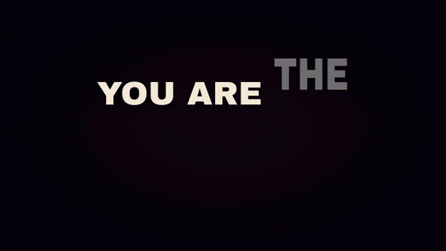
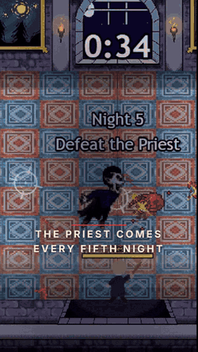
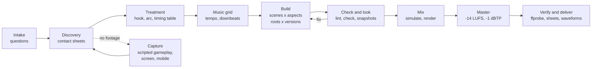
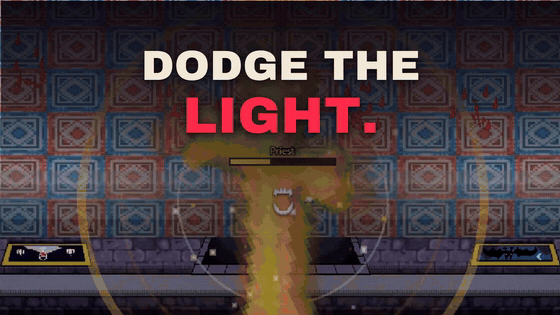
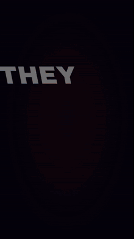
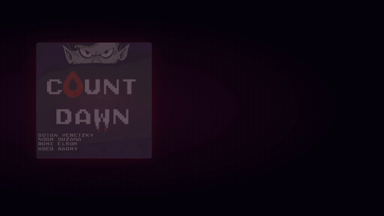

<div align="center">

# 🎬 Video Director

**A Claude Code skill that directs, edits and delivers professional videos end to end.**
Trailers, teasers, promos, launch videos, social cutdowns and app previews, built from your real footage, cut to the beat of your music, and delivered in every format you need.

[](https://docs.claude.com/en/docs/claude-code/skills)
[](https://hyperframes.heygen.com)
[](#formats-and-platforms)
[](LICENSE)

<table>
  <tr>
    <td align="center" valign="top"><br><sub><b>16:9</b> · hook, beat-synced cuts, held hero shot</sub></td>
    <td align="center" valign="top"><br><sub><b>9:16</b> · reframed for phones</sub></td>
  </tr>
</table>

<sub>Example output: a 30-second trailer for a pixel-art browser game, made with this skill from real gameplay captures, in three music versions and two aspect ratios.</sub>

</div>

> [!TIP]
> **Recommended model:** Claude Opus 5.5 at high effort. Directing and editing is long, multi-step work, and stronger models follow the full process (look, fix, look again) more reliably.
>
> **How the examples were made:** every edit, sound mix, render and master shown in this README was produced with Opus 5.5 at high effort, using this skill. The raw gameplay clips were captured beforehand with scripted browser capture.

---

## ✨ What it does

You describe the video. The skill makes Claude work like a trailer director and a senior editor, using [HyperFrames](https://hyperframes.heygen.com) (HTML-based video rendering) as the timeline and render engine.

| | |
| --- | --- |
| 🎯 **Directs** | Interviews you (project, must-show, length, platforms, ratios, quality, music, autonomy), writes the hook line, the arc and a beat-by-beat timing table |
| 🎞️ **Edits** | One `<video>` per cut from your real footage, cuts on the beat, punch-ins, pushes, pans, shake on impacts, a held money shot, a hard cut to black for the punchline |
| 🔤 **Animates type** | Kinetic slams sized with real font metrics, letter staggers, an accent word per screen, chromatic hits and flashes, safe zones for HUDs and platform overlays |
| 🎵 **Scores** | Verifies tempo and downbeats itself, locks scenes to bar lines, builds A/B/C music versions, places quiet purposeful SFX, simulates the mix, masters to -14 LUFS |
| 🎨 **Grades** | One consistent color treatment and subtle vignette on all footage through HyperFrames media treatments, no grain bloat |
| 📱 **Reformats** | Same timeline in 16:9, 9:16, 1:1 and 4:5 with reframed footage and re-laid type |
| 🎮 **Knows games** | Trailer types, what to show, Steam, itch.io, jams, app stores, HUD rules, platform beats, and scripted gameplay capture when you have no footage yet |
| ✅ **Checks its work** | Lint, layout and contrast audits, snapshots, contact sheets of every render, ffprobe, loudness and waveform checks at every music switch |
| 📦 **Delivers** | Final renders, share copies for WhatsApp/Discord, GIFs, an edit decision list and an A/B note with a director's pick per platform |

## 🧭 How it works



One picture edit is generated from data: a sub-composition per scene per aspect, plus a thin root file per music version. The picture is identical across versions; only the soundtrack and its accents change.

<p align="center">
  
  <br><sub>Punch-in on the in-game timer, a hard cut to black on the punchline, then a desktop + phone platform beat</sub>
</p>

## 🤔 Why a separate skill (and not one giant HyperFrames skill)

- **HyperFrames skills are maintained upstream** and refreshed with `npx hyperframes skills update`. Copying their contents into one mega-skill would go stale the day they ship a fix.
- **Skills work best focused and composable.** This skill owns the craft and the process (direction, editing, sound, look, QA, delivery). It loads `/hyperframes-core`, `/hyperframes-keyframes`, `/hyperframes-audio`, `/media-use` and friends when it needs the technical contract, the same way a director works with a camera team.
- **Progressive disclosure keeps context small.** `SKILL.md` is a short process map; each phase reads only its reference file (intake, director, game trailers, capture, editing, type, look, formats, sound, platforms, QA).
- **Deterministic work lives in scripts**, not in prose: beat grids, font fitting, mix simulation, mastering, contact sheets, GIFs and share copies.

## 🚀 Install

**Requirements:** [Claude Code](https://docs.claude.com/en/docs/claude-code), Node.js 22+, [FFmpeg](https://ffmpeg.org), Python 3 (with `numpy`; `fonttools` + `brotli` for font fitting). HyperFrames runs through `npx`, no global install needed.

```bash
git clone --depth 1 https://github.com/DotanVG/video-director-skill.git
cd video-director-skill
./install.sh            # macOS / Linux / Git Bash
# or
./install.ps1           # Windows PowerShell
```

The installer:

1. Copies `video-director/` into `~/.claude/skills/`. If a copy already exists, it moves it to `~/.claude/skill-backups/` first instead of deleting it.
2. Asks before running `npx hyperframes@0.8.114 skills update`, which installs the HyperFrames skills this skill builds on. HyperFrames is pinned to the version this skill was tested with.
3. Checks your tools, then tells you how to turn off HyperFrames telemetry. Restart Claude Code afterwards.

| Option (`install.sh` / `install.ps1`) | Effect |
| --- | --- |
| `--project` / `-Project` | Install into `./.claude/skills` instead of your home folder |
| `--skip-hyperframes` / `-SkipHyperFrames` | Don't touch HyperFrames skills (install them yourself later) |
| `--latest` / `-Latest` | Use the latest HyperFrames instead of the pinned version |
| `--no-telemetry` / `-NoTelemetry` | Turn off HyperFrames' anonymous usage telemetry |
| `--yes` / `-Yes` | Don't ask before installing the HyperFrames skills |

**Lightweight installation:** the installer copies only `video-director/` from this repository (about 106 KiB of file contents). HyperFrames skills and dependencies are additional downloads unless you use `--skip-hyperframes` / `-SkipHyperFrames`. The packaged `.skill` is about 53 KiB and contains no demo videos, GIFs or soundtracks. `examples/` contains silent GIF previews only. Supply your own footage and music when using the skill. The shallow clone above avoids downloading older media revisions, but still downloads the current previews (about 12.26 MiB).

Prefer manual? Copy the `video-director` folder into `~/.claude/skills/` and run `npx hyperframes@0.8.114 skills update`. A packaged `dist/video-director.skill` is attached to each [release](https://github.com/DotanVG/video-director-skill/releases) for apps that install `.skill` files.

## 🔒 What it runs on your machine

- **Local tools only:** FFmpeg, Node.js (HyperFrames through `npx`) and the Python helper scripts in `video-director/scripts/`. Renders happen on your machine.
- **No cloud by default:** the skill tells Claude never to use HeyGen cloud rendering, publishing, paid text-to-speech, or anything that uploads your files or spends credits without your explicit approval. Your files stay local unless you approve publishing.
- **Screen recording and dev servers:** only when you agree to capture new footage. Claude Code's normal permission prompts still apply to every command.
- **HyperFrames skills:** `skills update` installs or updates the HyperFrames skills for the AI coding tools it detects, and removes HyperFrames skills that are no longer published. Use `--skip-hyperframes` to manage them yourself.
- **Telemetry:** HyperFrames sends anonymous usage telemetry by default. Turn it off with `npx hyperframes telemetry disable`, `HYPERFRAMES_NO_TELEMETRY=1` or `DO_NOT_TRACK=1`, or install with `--no-telemetry`. This skill itself collects nothing.

Found a security problem? See [SECURITY.md](SECURITY.md).

## 💬 Use it

Just ask. The skill triggers on trailers, promos, social cuts and edits, even without naming it.

> Make a 30 s trailer for my game from the clips in `./captures`, 16:9 for Steam and 9:16 for TikTok, using the game's soundtrack. Work autonomously.

> I have no footage yet. My browser game runs on `npm run dev`. Capture gameplay clips of the core loop, a boss and a fail state, then cut a 20 s jam trailer.

> Turn these 6 screenshots of our SaaS dashboard into a 45 s launch video with our brand fonts and a calm-to-upbeat music switch.

> Give me three music versions of this cut and tell me which one to post on Reels.

> Review my existing trailer like a director and fix pacing, type and loudness.

The skill asks only what it cannot infer (at most four questions per round, with a recommended option first), states its defaults, and keeps everything local unless you approve publishing.

## 🎮 Game developers

- Trailer types: teaser, gameplay (store), launch, update, jam, mobile preview, social cutdowns.
- What to show, in order: core loop, hook mechanic, escalation, power fantasy, stakes, variety, platforms, call to action.
- **Steam:** gameplay in the first seconds, from the player's view, logo at the end; up to 1080p, 30/60 fps, H.264 + AAC, 5000+ kbps.
- **itch.io:** YouTube/Vimeo trailer embed plus an animated GIF cover cutdown (630x500).
- **App stores:** 15 to 30 s app previews captured from the app; Google Play uses a YouTube link.
- **No footage?** The capture guide covers ffmpeg screen capture on Windows/macOS/Linux, Playwright-driven browser games with bots that use real input, mobile emulation with touch, engine recorders (Unity Recorder, Unreal Movie Render Queue, Godot Movie Maker), and a clip index so every timestamp gets verified.

<p align="center">
  
  &nbsp;&nbsp;
  
  <br><sub>A kinetic hook built for phones, and an end card that holds: art, title, pitch, call to action, URL, credits</sub>
</p>

## 📐 Formats and platforms

| Platform | Aspect | Length | Notes |
| --- | --- | --- | --- |
| Steam | 16:9 | 30-90 s | gameplay first, 1080p, 5000+ kbps |
| itch.io | 16:9 + GIF | 30-90 s | GIF cover plays on hover |
| App Store | device-specific | 15-30 s | captured from the app |
| Google Play | landscape | first 30 s autoplay | YouTube link |
| YouTube | 16:9 | any | -14 LUFS |
| TikTok, Reels, Shorts | 9:16 | 15-60 s for trailers | keep text out of platform UI zones |
| X, LinkedIn | 16:9, 1:1, 4:5 | short | autoplay muted, burned-in text |
| WhatsApp, Discord | as made | short | 480p share copies, about 3 MB per 30 s |

Full table with sources in [`video-director/references/platforms.md`](video-director/references/platforms.md). Specs change; the skill checks official docs before final export.

## 🧰 What's inside

```
video-director/
├── SKILL.md                      process map, defaults, hard-won rules
├── references/
│   ├── intake.md                 question bank, defaults, autonomy levels
│   ├── director.md               hooks, arcs by video type, pacing, copy, A/B/C music
│   ├── game-trailers.md          trailer types, what to show, store and jam specifics
│   ├── capture.md                screen, browser, bot, mobile and engine capture
│   ├── editing.md                cut rhythm, camera math, HyperFrames patterns
│   ├── kinetic-type.md           type system, sizes, slam vocabulary, safe zones
│   ├── look.md                   color treatment, effects, end cards
│   ├── formats.md                16:9, 9:16, 1:1, 4:5 reframing
│   ├── sound.md                  beat grid, versions, SFX, mix, mastering, verification
│   ├── platforms.md              delivery specs per platform
│   └── qa-delivery.md            QA loop, pitfalls, render matrix, reports
├── scripts/
│   ├── contact_sheet.sh          timestamped contact sheets
│   ├── beat_grid.py              tempo, beat phase and downbeats from the audio itself
│   ├── font_fit.py               real glyph widths, largest size that fits
│   ├── simmix.py                 offline mix simulation (LUFS, true peak), SFX onsets
│   ├── master.py                 two-pass loudnorm, video copied, exact duration
│   ├── audio_window.py           envelope + waveform with beat grid at any moment
│   ├── make_gif.sh               palette GIFs
│   └── share_versions.sh         480p share copies
└── assets/
    ├── template/                 tested edit generator (kit.mjs, build.example.mjs, render-all.sh)
    └── doc-templates/            BRIEF, CLIPS, SCRIPT_FINAL, AB_TEST
```

| Script | Example |
| --- | --- |
| Contact sheet | `scripts/contact_sheet.sh clip.mp4 5 4 640 sheet.jpg 32.4 4` |
| Beat grid | `python scripts/beat_grid.py music.wav --start 14 --end 44` |
| Font fit | `python scripts/font_fit.py fonts/Display.woff2 --max-width 864 "HERO WORD."` |
| Mix simulation | `python scripts/simmix.py work/audio-plan.json` |
| Master | `python scripts/master.py renders/*.mp4 --lufs -14 --tp -1` |
| Waveform check | `python scripts/audio_window.py final.mp4 3.5 4.5 --grid 0.5` |
| GIF | `scripts/make_gif.sh final.mp4 2.5 9 560 10 out.gif` |
| Share copies | `scripts/share_versions.sh renders 480` |

## 🧪 Verified

- The edit generator template builds, passes `npx hyperframes check` (0 errors, contrast checks pass) and renders in 16:9 and 9:16.
- `beat_grid.py` matched a hand analysis exactly (120 BPM, downbeat at 14.000 s) and flags ambient tracks without a pulse.
- `simmix.py` predicted a render's loudness within 0.1 LU.
- The example trailer: six files (three music versions x two aspects), 30.0 s, 900 frames, -14.0 LUFS, music switch measured within 10 ms of the cut.

## 🙏 Credits

- Rendering: [HyperFrames](https://hyperframes.heygen.com) by HeyGen and its skills (`/hyperframes-core`, `/hyperframes-keyframes`, `/hyperframes-audio`, `/media-use`, ...).
- Skill format: [Agent Skills](https://docs.claude.com/en/docs/agents-and-tools/agent-skills/overview) by Anthropic.
- Trailer craft draws on widely shared practice from game trailer editors (gameplay first, hook within the first seconds, logo at the end).
- Created by Dotan Veretzky with Claude Code.

## 📄 License

The skill (everything in `video-director/`, the scripts and the install files) is MIT licensed, see [LICENSE](LICENSE).
The example GIFs in `examples/` contain game footage and art that belong to their creators. They are included only to demonstrate the skill and are not covered by the MIT license.
